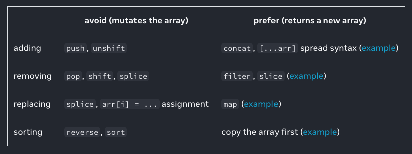

# Welcome to React Training

By, Lakhan Samani<br/>
Handle: lakhansamani<br/>
Email: lakhan.m.samani@gmail.com

<div class="pt-12">
  <span @click="$slidev.nav.next" class="px-2 py-1 rounded cursor-pointer" hover="bg-white bg-opacity-10">
    Press Space for next page <carbon:arrow-right class="inline"/>
  </span>
</div>

<div class="abs-br m-6 flex gap-2">
  <a href="https://github.com/lakhansamani" target="_blank" alt="GitHub" title="Open in GitHub"
    class="text-xl slidev-icon-btn opacity-50 !border-none !hover:text-white">
    <carbon-logo-github />
  </a>
</div>

<!--
The last comment block of each slide will be treated as slide notes. It will be visible and editable in Presenter Mode along with the slide. [Read more in the docs](https://sli.dev/guide/syntax.html#notes)
-->

---

# Agenda

<Toc maxDepth="1"></Toc>

---

# What is React

- React is a JavaScript library for rendering user interfaces (UI)
- UI is built from small units like buttons, text, and images.
- React lets you combine them into reusable, nestable components.
- Analogy: it is one way of extending HTML dictionary with custom tags & props

---

# Env Setup

- Install react-dev-tools (https://react.dev/learn/react-developer-tools) in your browser

---

# Setting up our first project

There are many ways to create React project and many transpilers written that will help convert React code into JS code

We will be using [Vite](https://vitejs.dev/guide/) here, which is fast and easy to use

```sh
npm create vite my-react-app
```

---

# Understanding project structure

- vite.config.ts
- tsconfig.json
- eslintrc.cjs
- package.json
- src/
- public/
- dist/

---

# Writing our first React Component

```jsx
function MyButton() {
  return <button>Click Me</button>;
}
```

- This is called JSX/TSX syntax where we can write markup in JS file

---

# Importing and exporting components

- Create multiple component files
- Use them in other components

```jsx
/// export
export function Profile() {
  return ;
}

/// import
export default function Gallery() {
  return (
    <section>
      <h1>Amazing scientists</h1>
      <Profile />
      <Profile />
      <Profile />
    </section>
  );
}
```

---

# How to use JS in JSX

- We use `{}` curly brackets for using JS variables in JSX

```jsx
export default function Avatar() {
  const avatar = 'https://i.imgur.com/7vQD0fPs.jpg';
  const description = 'Gregorio Y. Zara';
  return ;
}
```

- Using string interpolation

```jsx
export default function Profile() {
  const name = 'test';
  return <div>Hello World {name}</div>;
}
```

---

# Passing prop to a component

```jsx
/// export
export function Profile(props) {
  return ;
}

/// import
export default function Gallery() {
  return (
    <section>
      <h1>Amazing scientists</h1>
      <Profile name="Bob" picture="https://i.imgur.com/MK3eW3As.jpg" />
      <Profile name="John" picture="https://i.imgur.com/MK3eW3As.jpg" />
      <Profile name="Ram" picture="https://i.imgur.com/MK3eW3As.jpg" />
    </section>
  );
}
```

---

# Conditional Rendering

```jsx
export function Profile(props) {
  if (props.loading) {
    return <div>Loading...</div>;
  }
  return ;
}
```

- Inline conditional

```jsx
export function Profile(props) {
  return (
    <>
      {props.loading ? (
        <div>Loading</div>
      ) : (
        
      )}
    </>
  );
}
```

---

# Rendering List

```jsx
const users = [
  {
    id: 'u1',
    name: 'Ram',
  },
  {
    id: 'u2',
    name: 'Shyam',
  },
  {
    id: 'u3',
    name: 'Bob',
  },
];
const User = ({ user: { id: string, name: string } }) => <div>{user.name}</div>;
const Users = () => (
  return (
    <div>
      {users.map(item => (
        <User user={item} key={item.id}>
      ))}
    </div>
  )
)
```

---

# Handling Events

```jsx
export default function Button() {
  function handleClick() {
    alert('You clicked me!');
  }

  return <button onClick={handleClick}>Click me</button>;
}
```

---

# Hooks

Hooks are functions that let you “hook into” React state and lifecycle features from function components

- `useState`
- `useEffect`
- `useMemo`
- `useCallback`
- `useContext`

---

**Only Call Hooks at the Top Level**

**Don’t call Hooks inside loops, conditions, or nested functions**. Instead, always use Hooks at the top level of your React function, before any early returns. By following this rule, you ensure that Hooks are called in the same order each time a component renders. That’s what allows React to correctly preserve the state of Hooks between multiple

---

# State

- Component's memory
- Components often need to change what’s on the screen as a result of an interaction
  - Example form input data
  - Button click data change
  - Loading data

---

- The `useState` Hook provides those two things:

  - A state variable to retain the data between renders.
  - A state setter function to update the variable and trigger React to render the component again.

  ```jsx
  function App() {
    const [count, setCount] = useState(0);
    return (
      <button onClick={() => setCount((count) => count + 1)}>
        count is {count}
      </button>
    );
  }
  ```

> Note: arrays & objects are mutable so handle with care

---

# Handle Arrays / Objects



---

# Passing state data to child components

```jsx
export const Pararent = () => {
  const [count, setCount] = useState(0);
  return (
    <div>
      <ChildButton count={count}>
    </div>
  );
};
```

```jsx
export const ChildComponent = ({ count }) => {
  return <button>count {count}</button>;
};
```

---

# Updating parent component state

- We use functions that can be passed as prop to child components and called at the end of a relevant event

```jsx
export const Pararent = () => {
  const [count, setCount] = useState(0);
  function updateCount() {
    setCount(count + 1);
  }

  return (
    <div>
      {count}
      <ChildButton handleClick={updateCount}>
    </div>
  );
};
```

```jsx
export const ChildComponent = ({ handleClick }) => {
  return <button onClick={handleClick}>click</button>;
};
```

---

# useEffect hook

Call `useEffect` at the top level of your component to declare an Effect:

```js
useEffect(callbackFunction, dependenciesArray?)
```

---

```jsx
export const Component = () => {
  useEffect(() => {
    let isComponentLoaded = true
    async fetchData() {
      // get Data from server
      if (isComponentLoaded) {
        // then only update the state
      }
    }
    fetchData()

    // Clean up mode
    return () => {
      isComponentLoaded = false
    }
  }, []);
};
```

---

# Context

- Context lets the parent component make some information available to any component in the tree below it—no matter how deep—without passing it explicitly through props.

---

# Theme Provider - context

```jsx
const ThemeContext = createContext({
  primary: '#fff',
  secondary: '#000',
});

const App = () => {
  return (
    <ThemeContext.Provider
      value={{
        primary: '#fff',
        secondary: '#000',
      }}
    >
      {children}
    </ThemeContext.Provider>
  );
};

const Button = () => {
  const theme = useContext(ThemeContext);
  return (
    <button
      style={{
        background: theme.primary,
        color: theme.secondary,
      }}
    >
      Click Me
    </button>
  );
};
```

---

Complex Provider

```jsx
import { createContext, useContext, useState } from 'react';

const ThemeContext = createContext({
  theme: {
    primary: '#000',
    secondary: '#fff',
  },
  toggleTheme: () => {},
});

export const ThemeProvider = ({ children }: { children: React.ReactNode }) => {
  const { theme: defaultTheme } = useContext(ThemeContext);
  const [theme, setTheme] = useState(defaultTheme);

  const toggleTheme = () => {
    setTheme({
      primary: theme.secondary,
      secondary: theme.primary,
    });
  };

  return (
    <ThemeContext.Provider value={{ theme, toggleTheme }}>
      {children}
    </ThemeContext.Provider>
  );
};
```

---

# Handling Form

```jsx
function ContactUsForm() {
  const [email, setEmail] = useState('');
  const [message, setMessage] = useState('');

  const handleEmailChange = (event: React.ChangeEvent<HTMLInputElement>) => {
    setEmail(event.target.value);
  };
  const handleMessageChange = (
    event: React.ChangeEvent<HTMLTextAreaElement>
  ) => {
    setMessage(event.target.value);
  };
  const handleSubmit = (e: React.FormEvent<HTMLFormElement>) => {
    e.preventDefault();
    const data = {
      email,
      message,
    };
    console.log({ data });
  };
  return (
    <form onSubmit={handleSubmit}>
      <label htmlFor="email">Email</label>
      <input type="email" id="email" onChange={handleEmailChange} />
      <label htmlFor="message">Message</label>
      <textarea id="message" onChange={handleMessageChange} />
      <button type="submit">Send</button>
    </form>
  );
}

```

---

# Custom Hooks

```js
function useOnlineStatus() {
  const [isOnline, setIsOnline] = useState(true);
  useEffect(() => {
    function handleOnline() {
      setIsOnline(true);
    }
    function handleOffline() {
      setIsOnline(false);
    }
    window.addEventListener('online', handleOnline);
    window.addEventListener('offline', handleOffline);
    return () => {
      window.removeEventListener('online', handleOnline);
      window.removeEventListener('offline', handleOffline);
    };
  }, []);
  return isOnline;
}
```

---

# Exercise

- Create a react application
- Create a context provider for global configurations
- Create a layout which shows menu on side and data on right
- Fetch users and list them
- Add search users
